## Rwetac and Runtime: A Eta compiler

This is the compiler rwetac and its runtime.
It compiles .eta files to .wat.

Wasmer is used as its runtime and the runtime defines a memory allocator(malloc).


## Getting started

The only thing you need to install is Rust. Everything else — including
[Wasmer](https://wasmer.io), which executes the generated WebAssembly — is a
cargo dependency and is fetched and built for you.

Install via [rustup.rs](https://rustup.rs). This workspace uses edition 2024, so
Rust **1.85 or newer**:

```
git clone https://github.com/XFabian/compiler-construction-unitn.git
cd compiler-construction-unitn
cargo build --workspace
cargo test  --workspace
```

Then compile and run a program:

```
cargo run --bin rwetac  -- demos/2.5-ast/01_functions.eta   // writes 01_functions.wat
cargo run --bin runtime -- demos/2.5-ast/01_functions.wat   // prints Result : [I64(42)]
```

A successful compile prints nothing. See [Inspecting each
phase](#inspecting-each-phase) for how to look at what it produced, and
[demos/](demos/) for the worked examples.

### Optional tools

None of these are needed to build, run or test the compiler.

| Tool | Needed for |
|---|---|
| [Graphviz](https://graphviz.org) (`dot`) | rendering the `.dot` CFG files written by `--dump`; `rwetac/dot2pdf.sh` drives it |
| [WABT](https://github.com/WebAssembly/wabt) (`wat2wasm`) | converting the emitted `.wat` to binary `.wasm` |
| `cargo install cargo-insta` | reviewing snapshot test changes |


## Compiler CLI

The compiler is invoked by 
```
cargo run --bin rwetac -- <File>
cargo run --bin rwetac -- --help
```

A successful compile prints nothing. Errors are reported with a line and column
and exit non-zero.

The compiler traces every phase. The default level is `warn`; set `RUST_LOG`
to see more.

```
RUST_LOG=info  cargo run --bin rwetac -- <File> // One line per phase
RUST_LOG=debug cargo run --bin rwetac -- <File> // Everything the compiler does
```


### Filters for logging
The filter takes a module path, so you can turn up one phase and leave the rest alone.
Some examples
```
RUST_LOG="rwetac::typecheck=debug" cargo run --bin rwetac -- <File> // See debug logs of only module typecheck
RUST_LOG=rwetac::typecheck=debug,rwetac=info .... // Debug logs of typecheck module and info for everything else
```
All other options are explained by the --help flag.

### Choosing optimizations

`--opt` runs every pass to a fixed point. To run a specific pipeline instead,
use `--passes`, which takes an ordered list. A group written `fixpoint(...)`
repeats until none of its passes changes anything.

```
rwetac --report-passes                             // list the available passes
rwetac --passes cf,dce <File>                      // just these two, in this order
rwetac --passes 'fixpoint(cp,copy,cf,dce)' <File>  // repeat until nothing changes
rwetac --passes '' <File>                          // no passes, but still round-trip the CFG
```

Order is yours to choose, and it matters. `--count` reports WTAC instruction
counts before and after so you can see whether a pass did anything:

```
RUST_LOG=error rwetac --passes 'fixpoint(cp,copy,cf,dce,ptr,stl)' --count <File>
```

On `rwetac/tests/inputs/const_prop.eta`:

| pipeline | WTAC instructions |
|---|---|
| `--passes ''` (CFG round-trip only) | 30 |
| `--passes 'cf'` | 30 |
| `--passes 'dce'` | 29 |
| `--passes 'cp,copy,cf,dce'` | 21 |
| `--passes 'fixpoint(cp,copy,cf,dce,ptr,stl)'` | 17 |

A `fixpoint(...)` group gives up after 1000 iterations and warns, naming the
passes involved.

## Inspecting each phase

Compilation can be stopped after any phase, printing the representation that
phase produced.

```
lex -> parse -> resolve -> typecheck -> WTAC IR -> (optimize) -> WASM
        ^          ^-----------^          ^                        ^
     --parse         --validate         --wtac                 --codegen
```

| Flag | Stops after | Prints |
| --- | --- | --- |
| `--parse` | parsing | the AST, as a Rust `Debug` dump |
| `--validate` | name resolution + typechecking | nothing on success; the error otherwise |
| `--wtac` | WTAC IR generation | the IR, in its own readable syntax |
| `--codegen` | everything (the default) | nothing; writes `<file>.wat` next to the source |

Each stage includes the ones before it, so `--wtac` still lexes, parses,
resolves and typechecks first. With no flag at all you get `--codegen`.

Nothing but the representation is printed:

```
cargo run --bin rwetac -- --parse    program.eta   // the AST after parsing
cargo run --bin rwetac -- --validate program.eta   // silence means it typechecks
cargo run --bin rwetac -- --wtac     program.eta   // the three-address IR
cargo run --bin rwetac -- program.eta              // full compile to program.wat
```

Adding `RUST_LOG=info` to any of these shows the phases running underneath.

For example, `--wtac` on a recursive `fib` shows the IR the backend consumes:

```
fib(i.0 : i64) -> i64 {
        block func_exit: {
                block if_end.8: {
                        block if_else.8: {
                                tmp.2 : i32 = i.0 < 2:i64
                                br tmp.2 if_else.8
                                ...
```

`--dump` writes the intermediate representations to a `<file>_debug/`
directory, including the CFG as Graphviz `.dot` files when optimization is on.
`rwetac/dot2pdf.sh` renders those to PDF.

### A note on `--opt`

**The optimizer is experimental. If something misbehaves, first re-run without
it.** Optimization is off by default, so plain

```
cargo run --bin rwetac -- program.eta
```

runs no passes at all and does not touch the CFG. Only `--opt` and `--passes`
turn it on. If a program works without them and breaks with them, that is an
optimizer bug, not a bug in your program.

## Generating the documentation

Every module carries a `//!` header explaining its role, and the interesting
types and functions are documented individually. `cargo doc` turns that into a
browsable site:

```
cargo doc --no-deps --document-private-items --open
```


## The Compiler architecture

The architecture is similar to the one in the lecture. Here is a quick overview over the passes and the files implementing them

```mermaid
---
config:
  layout: dagre
---
flowchart TD
 subgraph Sem["Semantic_Analysis"]
        RES["Resolver"]
        Types["Types"]
        TC["Type Checker"]
  end

  subgraph Lex["Lexing"]
        Tok["Token"]
        Lexer["Lexer"]
  end

    subgraph PAR["Parsing"]
        Ast["Ast"]
        Parser["Parser"]
  end
  subgraph IR["IR"]
        Wtac["WTAC"]
        Gen["WTAC Generation"]
        WPrint["WTAC Printing"]
  end

  subgraph Opt["Optimization"]
        CFG["CFG"]
        Optimizer["Optimizer"]
        Solver["Solver"]
        Dot[...]
  end
    Source[".eta"] --> Lex
    Lex --> PAR
    PAR --> Sem
    Sem --> IR
    IR --> Opt
    Opt --> CODEGEN["Code Generation"]
    CODEGEN --> wat[".wat"]
    click RES "https://github.com/XFabian/compiler-construction-unitn/tree/main/rwetac/src/resolver.rs"
    click TC "https://github.com/XFabian/compiler-construction-unitn/tree/main/rwetac/src/typecheck.rs"
    click Types "https://github.com/XFabian/compiler-construction-unitn/tree/main/rwetac/src/types.rs"
    click Lexer "https://github.com/XFabian/compiler-construction-unitn/tree/main/rwetac/src/lexer.rs"
    click Tok "https://github.com/XFabian/compiler-construction-unitn/tree/main/rwetac/src/token.rs"
    click Ast "https://github.com/XFabian/compiler-construction-unitn/tree/main/rwetac/src/ast.rs"
    click Parser "https://github.com/XFabian/compiler-construction-unitn/tree/main/rwetac/src/parser.rs"
    click Wtac "https://github.com/XFabian/compiler-construction-unitn/tree/main/rwetac/src/wtac/wtac_ast.rs"
    click Gen "https://github.com/XFabian/compiler-construction-unitn/tree/main/rwetac/src/wtac/wtac_gen"
    click WPrint "https://github.com/XFabian/compiler-construction-unitn/tree/main/rwetac/src/wtac/wtac_print.rs"
    click CFG "https://github.com/XFabian/compiler-construction-unitn/tree/main/rwetac/src/opt/cfg.rs"
    click Optimizer "https://github.com/XFabian/compiler-construction-unitn/tree/main/rwetac/src/opt/optimizer.rs"
    click Solver "https://github.com/XFabian/compiler-construction-unitn/tree/main/rwetac/src/opt/solver.rs"
    click CODEGEN "https://github.com/XFabian/compiler-construction-unitn/tree/main/rwetac/src/emitter.rs"


```



There are a few helpers used throughout the compiler:


---

| File                                         | Description                                                                                                                                                                                              |
| -------------------------------------------- | -------------------------------------------------------------------------------------------------------------------------------------------------------------------------------------------------------- |
| [symbols.rs](./rwetac/src/symbols.rs)        | Main symbol table. Stores information about symbols, like their types, if they are function, local, global or a record -- so called attribute. Used througout all phases. Akin to a global symbol table. |

---
The optimization pass implements a Dataflow Analysis framework in solver.rs. Especially look at the Analysis Trait.
Here we look at the other files used for optimziation:

| File                                            | Description                                                                                                                                                |
| ----------------------------------------------- | ---------------------------------------------------------------------------------------------------------------------------------------------------------- |
| [reaching.rs](./rwetac/src/opt/reaching.rs)     | Describes the Reaching Analysis. Computes the Use-Def Map. This is used for Constant Propagation, Copy Propagation. Furthermore performs constant folding. |
| [liveness.rs](./rwetac/src/opt/liveness.rs)     | Implements the Liveness Analysis. This is used for Dead code elimination – removes unreachable or unused code.                                             |
| [memory.rs](./rwetac/src/opt/memory.rs)         | Performs optimization related to Memory accesses. Uses a PointerAnalysis and canonicalizes pointers. Implements Store to Load forwarding                   |
| [dominators.rs](./rwetac/src/opt/dominators.rs) | Describes the Dominator and Postdominator Analysis                                                                                                         |


---
And now a table giving some more information for each file


| File                                            | Description                                                                                                                                                |
| ----------------------------------------------- | ---------------------------------------------------------------------------------------------------------------------------------------------------------- |
| [main.rs](./rwetac/src/main.rs)                                    | Driver for the Compiler. Defines CLI and calls compile with the options
| [compile.rs](./rwetac/src/compile.rs)                               | Depending on stage executes the compiler until that point. Main entrypoint into compiler
| [setting.rs](./rwetac/src/setting.rs)                                  | Defines the Stage Enum to decide until which stage to run the Compiler.
| [util.rs](./rwetac/src/util.rs)                                    | Some helpers like rounding number to specific multiple or extending a file name.
| [source_map.rs](./rwetac/src/source_map.rs)                                    | Contains the program code. Used to lookup line numbers for error reporting.
| [token.rs](./rwetac/src/token.rs)                                    | Defines the Token Enum using Logos. 
| [lexer.rs](./rwetac/src/lexer.rs)                                    | Takes the input String and creates a Token Stream in the form of an Iterator. Adds Semicolons to the program.
| [ast.rs](./rwetac/src/ast.rs)                                    | Definition of the Abstract Syntax Tree for Eta.
| [types.rs](./rwetac/src/types.rs)                                    | Definition of the Types for Eta.
| [parser.rs](./rwetac/src/parser.rs)                                    | Definition of the handwritten Recursive Descent Parser for Eta. Uses the Iterator from the Lexer.
| [resolver.rs](./rwetac/src/resolver.rs)                                    | First part of Semantic Analysis. Resolves variables and checks for duplicates. Enforces Scope rules and renames shadowed variables for clarity.
| [typecheck.rs](./rwetac/src/typecheck.rs)                                    | Second part of Semantic Analysis. Implements type checking for Eta roughly following the [specification](https://www.cs.cornell.edu/courses/cs4120/2023sp/project/types.pdf?1677546547). Populates the Symbol Table with type and additoinal Infor for each symbol in the program
| [wtac_ast.rs](./rwetac/src/wtac/wtac_ast.rs)                                    | Definition of the Typed Intermediate Language called WTac.
| [wtac_print.rs](./rwetac/src/wtac/wtac_print.rs)                                    | Pretty Printing for Wtac programs
| [wtac_gen.rs](./rwetac/src/wtac/wtac_gen)                                    | Transforms Ast into a Wtac program. Most complicated part of the compiler
| [emitter.rs](./rwetac/src/emitter.rs)                                    | Takes Wtac program and emits WASM in text form
| [opt](./rwetac/src/opt)                                    | The optimization pipeline is explained above.

## The Eta Grammar

`rwetac` implements the [Eta language](https://www.cs.cornell.edu/courses/cs4120/2026sp/project/language.pdf)
from Cornell CS 4120.

The grammar below describes what the hand-written parser in
[parser.rs](./rwetac/src/parser.rs) actually accepts. Where it differs from the
Cornell specification, that is listed under
[Divergences](#divergences-from-the-cornell-specification) — read that section
before assuming a program from the Cornell handout will compile here.

Records are **not** part of Eta; upstream they belong to Rho, the extension
students add in their final assignment. `rwetac` implements them anyway, and
they are specified separately in [Records](#records-an-extension-to-eta) so that
the core grammar stays the language the Cornell handout describes.

Notation: `{ x }` means zero or more, `[ x ]` means optional, and `|` separates
alternatives. Terminals are quoted, so the Eta or-operator is written `"|"`.

### Lexical structure

```
Ident   ::= ( letter | "_" ) { letter | digit | "_" }
IntLit  ::= digit { digit }
StrLit  ::= '"' { char | escape } '"'
Comment ::= "//" { any character except newline }
```

Spaces, tabs and form feeds separate tokens and are otherwise ignored.
Comments are skipped. Integer literals are parsed as `i64`; there is no
negative literal, `-1` is the unary operator applied to `1`.

A string literal is not a type — it desugars to an array literal of character
codes, so `"AB"` and `{65, 66}` are the same expression.

### Semicolon insertion

Eta source rarely contains semicolons because the lexer inserts them. A newline
becomes a `";"` **only if** the preceding token could end a statement, that is
one of:

```
Ident   IntLit   StrLit   "true"   "false"   "return"   ")"   "}"   "]"   "int"   "bool"
```

Any other newline is discarded. A final `";"` is also inserted at end of file if
the last token was one of the above. Explicit semicolons are always accepted,
which is how two statements fit on one line:

```
a : int = 1; largest : int = 1
```

This rule is worth understanding before touching the parser, because it explains
two things that otherwise look arbitrary: the optional `";"` after an `if` or
`while` guard (the newline before the body inserts one), and why a block closing
with `} else` has no semicolon while a block closing with `}` followed by a
newline does.

**This is not what the Cornell specification says.** In Eta proper, semicolons
are *entirely optional* and newlines carry no meaning at all — a statement may
be terminated by a `";"` or not, even when two statements share a line. Eta
keeps that unambiguous by forbidding the left-hand side of an assignment from
beginning with `"("`, `"{"` or `'"'`, which guarantees that an opening bracket
after a complete expression always *continues* that expression.

`rwetac` takes the Go approach instead: newlines are significant and the lexer
inserts the separator. The two rules genuinely disagree. Under the Cornell rule

```
a = f
(1)
```

is the call `a = f(1)`, because a statement can never start with `"("`. Under
`rwetac` a `";"` is inserted after `f`, so this is a parse error. The newline is
load-bearing here, and that is the price of the design.

Consequences worth knowing before you write Eta by hand — all of these are
parse errors:

```
a : int = 1          // a ";" is inserted after `1` ...
    + 2              // ... so this line starts with an operator

return               // `return` is a semicolon candidate, so this
    5                // returns nothing and then fails on `5`

f(1                  // ";" inserted inside the argument list
    , 2)

a : int = 1 b : int = 2      // no newline, no inserted ";"
```

The fix in every case is to break the line after the operator or comma rather
than before it, or to write the `";"` explicitly. Breaking *after* an operator
is always safe, because an operator is never a semicolon candidate:

```
a : int = 1 +
    2                // fine
```

One more consequence: `"{"` starts a compound block statement, so an array
literal is not a statement — `{1, 2}` on a line of its own is parsed as a block
whose contents are not statements, and fails.

### Declarations

```
Program     ::= { Declaration ";" }

Declaration ::= FunDecl | GlobalDecl

FunDecl     ::= Ident "(" [ Param { "," Param } ] ")"
                [ ":" Type { "," Type } ] "{" { Statement } "}"
Param       ::= Ident ":" Type

GlobalDecl  ::= Ident ":" PrimType { "[" [ Expr ] "]" } [ "=" Expr ]
```

A declaration is a function when an `"("` follows the name, and a global
variable otherwise — that is the one place the parser needs two tokens of
lookahead.

Several parameters may share a type: `x, y : int` declares two `int` parameters.
A function with no return-type list is a procedure.

### Types

```
Type        ::= PrimType { "[" "]" }
PrimType    ::= "int" | "bool"
```

Note that a *type* takes only empty brackets (`int[][]`), while a *declaration*
may give sizes (`a : int[3][4]`). That is why `Type` and the bracket suffix in
`GlobalDecl` and `Decl` are separate productions.

### Statements

```
Statement   ::= If | While | Return | ProcCall | LocalDecl | Assign | Compound

If          ::= "if" Expr [ ";" ] Statement [ "else" Statement ]
While       ::= "while" Expr [ ";" ] Statement
Return      ::= "return" [ Expr { "," Expr } ] ";"
ProcCall    ::= Ident "(" [ Expr { "," Expr } ] ")" ";"
Compound    ::= "{" { Statement } "}" ";"
LocalDecl   ::= Decl [ "=" Expr ] ";"
Assign      ::= LVal { "," LVal } "=" Expr { "," Expr } ";"

LVal        ::= Decl | Expr
Decl        ::= Ident ":" PrimType { "[" [ Expr ] "]" }
```

Guards need no parentheses. The `";"` in `Compound` is omitted when the next
token is `else`.

`Assign` is how multiple assignment and multiple declaration are written, and
its left-hand side mixes both forms, so all of these are one production:

```
a, b = b, a
a[i], a[j] = a[j], a[i]
x : int, y = f()
```

### Expressions

```
Expr        ::= OrExpr
OrExpr      ::= AndExpr { "|" AndExpr }
AndExpr     ::= EqExpr  { "&" EqExpr }
EqExpr      ::= RelExpr { ( "==" | "!=" ) RelExpr }
RelExpr     ::= AddExpr { ( "<" | "<=" | ">" | ">=" ) AddExpr }
AddExpr     ::= MulExpr { ( "+" | "-" ) MulExpr }
MulExpr     ::= Unary   { ( "*" | "/" | "%" ) Unary }
Unary       ::= ( "-" | "!" ) Unary | Postfix
Postfix     ::= Primary { "[" Expr "]" | "(" [ Expr { "," Expr } ] ")" }
Primary     ::= IntLit | "true" | "false" | Ident | StrLit
              | "(" Expr ")"
              | ArrayLit
ArrayLit    ::= "{" [ Expr { "," Expr } [ "," ] ] "}"
```

The parser does not use these layered productions directly — it uses precedence
climbing, and the table below is the precedence it climbs. The productions above
are the equivalent grammar, given here because that is the form the lecture uses.

| Precedence | Operators | Associativity |
|---|---|---|
| highest | `f(...)` `a[i]` `a.x` | left |
| | `-` `!` (unary) | — |
| 6 | `*` `/` `%` | left |
| 5 | `+` `-` | left |
| 4 | `<` `<=` `>` `>=` | left |
| 3 | `==` `!=` | left |
| 2 | `&` | left |
| 1 | `\|` | left |

This matches the Cornell precedence table exactly.

A call is only legal when the callee is a bare identifier: `f(x)` parses, but
`(g)(x)` and `a[0](x)` are rejected with *"Identifer Expected before Function
Call"*. There are no function values.

An array literal may carry a trailing comma (`{1, 2, 3,}`) and may be empty
(`{}`). No other comma-separated list allows a trailing comma.

`length(a)` is not a keyword here — it parses as an ordinary call and is given
its meaning by the typechecker.

### Divergences from the Cornell specification

Things in the Cornell Eta spec that `rwetac` does **not** implement:

| Feature | Status |
|---|---|
| `use` declarations and `.eti` interface files | not implemented, single source file only |
| the `_` pseudo-variable for discarding results | not implemented |
| `*>>` high multiplication | not implemented |
| character literals (`'a'`) | not implemented |
| `'` in identifiers (`n'`, `q'`) | not implemented — identifiers are `[_a-zA-Z][_0-9a-zA-Z]*` |
| short-circuit `&` and `\|` | **not implemented** — both operands are always evaluated, so `i < length(a) & a[i] == 0` reads out of bounds when the guard is false |
| array bounds checking | not implemented, an out-of-range index is undefined behaviour |
| array `==` / `!=` alias comparison | not implemented |
| `return` must be the last statement in its block | not enforced |
| declarations without initializer, comma-separated (`a : int, b : int`) | parse error — an `=` is required after a multi-element left-hand side |
| semicolons fully optional between same-line statements | see [Semicolon insertion](#semicolon-insertion) — the rules are not the same |

### Records: an extension to Eta

Records are not in the Eta specification. They are `rwetac`'s own extension, and
correspond to the records that Cornell students add in Rho. Everything in this
section is *in addition to* the grammar above.

```
Declaration ::= ... | RecordDecl

RecordDecl  ::= "record" Ident "{" { MemberDecl ";" } "}"
MemberDecl  ::= Ident { "," Ident } ":" Type

PrimType    ::= ... | Ident                 -- a record name
Postfix     ::= ... | "." Ident             -- field access
```

Members are terminated the same way statements are, so in practice one per line:

```
record Point {
    x : int
    y : int
}
```

Several fields may share a type, exactly like parameters:

```
record Point {
    x, y : int
}
```

The comma there separates *names*, not members. A comma between fields of
different types is a parse error — write them on separate lines.

A record is constructed by calling its name, which needs no grammar of its own
because it parses as an ordinary call and is given its meaning by the
typechecker:

```
p : Point = Point(1, 2)
```

Field access works as both an rvalue and an assignment target, including inside
a multiple assignment:

```
p.x, p.y = p.y, p.x
```

Two current restrictions, both enforced by the typechecker rather than the
parser: a record may not contain another record, and records may not be used as
global variables.


# Runtime

The runtime provides a way to execute the generated .wat files.
call with 
```
cargo run --bin runtime -- <FILE>
cargo run --bin runtime -- --help
```

It also provides the memory allocation for arrays. This is eta_malloc, which is a simple Bump Allocator.
Because, we exectue the WASM code, we can read out the memory at the end of execution. Thus, we can see the values of our arrays
Runtime provides two helpers:

 `dump_memory_region()`: Dumps the Heap that the program used into a .bin file. Can be inspected by a Hex editor (Arrays store length at location -1 and then store each entry side by side)
 `view_array()` Given a start location in memory and the array type and length. It prints out the memory at this location.

 Furthermore, the `eta_malloc()` prints out how much memory was allocated and what the state of the pointe ris.

 This is all done by exposing a global `__heap_base` inside the .wat program that is incremented by `eta_malloc`


### Used packages and Cargo CLI
I tried to minimize the packages needed for the project 

--- 
Compiler:
- **clap** : Used for CLI
- **anyhow** : Generic Error Handling crate that works with any Error Type
- **logos** : Used for Tokens
- **peekmore** : Iterator which allows for peek(n)
- **unescaper** : Used in Lexer to unescape Strings.
- **pretty** : For defining Pretty Printers. See Emitter.
- **tracing** : Logger library
- **tracing-subscriber** : Needed for Logger
- **wat** : Used in testing to WASM type check generated .wat files
- **insta** : Used for Snapshot testing

Crate insta works best with its own CLI tool
```
cargo install cargo-insta
```

Run the tests with 
```
cargo insta test
```


Next the generated snapshots can be reviewed
```
cargo insta review
```

The inline results can be seen in for example [typecheck_test.rs](./rwetac/tests/typecheck_test.rs).

---
Runtime:
- **wasmer** : Used to execute wasm files. Big library with lots of tools.
- **anyhow** : Generic Error Handling crate that works with any Error Type


## License

MIT. See [LICENSE](LICENSE).
